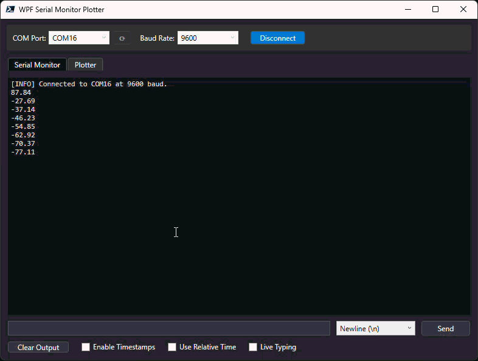

# 📈 WPF Serial Monitor & Plotter

A modern, standalone serial port monitor and real-time data plotter built entirely with PowerShell and Windows Presentation Foundation (WPF). Monitor text logs and instantly visualize raw data on a live, auto-scaling graph with zero external dependencies.

---

## 🚀 Quick Start
Open PowerShell (5.1+) and run this command to launch instantly from memory:
```powershell
irm bit.ly/SerialMonPlots | iex
```

## 🎨 Preview


## ✨ Features
* **⚡ Zero-Installation**: Runs as a standalone PowerShell script with no external files or setups required.
* **📈 Data Plotter**: Switch between text logging console and a real-time data plotter to visualize raw numerical streams with dynamically adjusting X and Y axes.
* **⌨️ Live-Typing Mode**: Transmits characters to the device the exact instant they are typed, featuring arrow-key and special code tracking.
* **🚀 Fast**: Leverages thread-safe concurrent queues to process dense serial loads without hanging the UI.

## 🛠️ Requirements
|   **Component**  	| **Minimum Requirement** 	|
|:----------------:	|:-----------------------:	|
| Operating System 	| Windows 7 or newer      	|
| PowerShell       	| Version 5.1 or higher   	|
| .NET Framework   	| Version 4.5 or higher   	|

## ✅ ToDo List
- [ ] Implement an adjustable X and Y tick marks for the plotter.
- [ ] Implement an option to stream logs directly to local storage .txt or .log files.
- [ ] Implement configurable data streams format and regex for the plotter.
- [ ] Add support for plotting multiple data as multiple curves.
- [ ] Add expansion profiles for extra special characters and key codes inside Live-Typing mode.

## 📄 License
This project is licensed under the MIT License. See the [LICENSE](LICENSE) file for details.